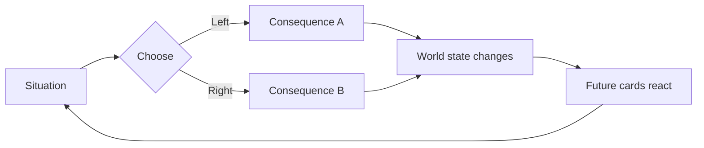
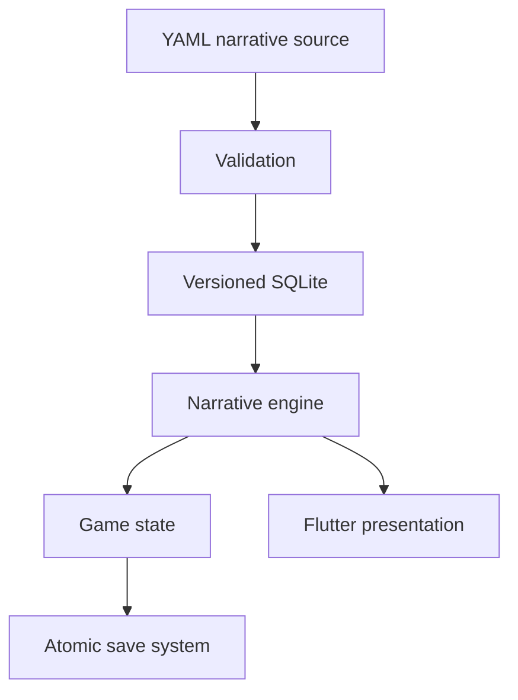

  

# Riven Seas — Public Roadmap

> Public-safe project overview · Roadmap Revision 2.0 · 29 September 2026  
> Story spoilers, ending conditions, hidden narrative formulas and internal production notes are intentionally excluded.

  <strong>Every choice leaves a wake.</strong> 
  Narrative pirate adventure · Android-first · Offline-first · Flutter · 5 languages

## Project vision

**Riven Seas** is a premium narrative pirate game built around fast binary decisions, persistent consequences and replayability.

You play a pirate captain whose decisions affect the crew, resources, reputation, recurring characters and the wider world. The experience is built around illustrated situations, concise choices, short transitions and a deep state-driven narrative system rather than real-time combat.

## Visual direction

<table>
<tr>
<td width="35%" align="center">
   
  Identity mark
</td>
<td width="65%">
  <strong>Target mood</strong>  
  Dark oceanic blues, weathered gold, cinematic lighting, dangerous horizons and readable premium UI. The visual language should feel authored and adventurous without becoming ornamental at the expense of usability.
</td>
</tr>
</table>

<table>
<tr>
<td width="50%" align="center">
   
  <strong>Home / voyage concept</strong>
</td>
<td width="50%" align="center">
   
  <strong>Decision-card concept</strong>
</td>
</tr>
</table>

> The four showcased visuals are **directional concept art**. They define atmosphere, hierarchy and quality ambition, but they are not contractual final screenshots. Shipping UI must still pass responsive, accessibility, performance and device validation.

## Core experience

Each card is one playable decision with two possible responses and persistent consequences.

### Main visible systems

- **Crew**
- **Gold**
- **Hull**
- **Reputation**

Hidden systems track relationships, factions, knowledge, inventory, legacy flags and delayed consequences.

## Release roadmap

Targets are cumulative.

| Version | Cards | Arcs | Characters | Endings | Visual cap | Download target |
|---|---:|---:|---:|---:|---:|---:|
| **V1** | 600 | 100 | 45 | 12 | 170 | 45–55 MB |
| **V2** | 900 | 120 | 60 | 18 | 220 | ≤62 MB |
| **V3** | 1,200 | 140 | 75 | 24 | 270 | ≤70 MB |
| **V4** | 1,600 | 160 | 90 | 30 | 320 | 70–78 MB |
| **Absolute cap** | — | — | — | — | — | **80 MB** |

V4 targets a structure of **20 sagas × 8 arcs**, with replayability driving long-term discovery.

## Product principles

- **Android first**
- **Offline-first gameplay**
- **No advertising**
- **No subscription**
- **One-time full-game unlock**
- **French as canonical writing language**
- **English, Spanish, German and Brazilian Portuguese produced in parallel**
- **Responsive portrait and landscape layouts**
- **Phone and tablet support**
- **Large text and accessibility support**
- **Deterministic saves and decisions**
- **No silent reduction of approved scope**

## Technical direction

The architecture keeps narrative rules, content, saves and presentation separate.

The goal is simple: **adding narrative content should not require adding new UI code**.

## Localization

Every completed content batch must exist in:

- French
- English
- Spanish
- German
- Brazilian Portuguese

The production flow includes writing, translation, review, pseudo-localization and real-device layout validation.

## Responsive & accessibility targets

The project is designed to support:

- small phones;
- standard and large phones;
- tablets;
- portrait and landscape;
- live rotation;
- Android display scaling;
- large text up to 2.0 and maximum practical system size;
- cutouts and system bars;
- gesture and 3-button navigation;
- TalkBack;
- reduced motion;
- minimum 48 dp interactive targets.

**Zero clipped player-facing content and zero critical overflow are release requirements.**

## Quality targets

Release gates include:

- zero P0/P1 defects;
- deterministic save/reload behavior;
- no duplicated decision application;
- valid narrative graphs;
- complete localization parity;
- responsive layout validation;
- accessibility checks;
- migration coverage for published saves;
- target 60 fps during swipe interaction on a reference mid-range device;
- first interactive view target P90 ≤3 seconds;
- strict download-size budgets.

## Monetization

The free version is planned to include a coherent prologue with its own resolution.

The full game is unlocked through a **single non-consumable purchase**.

No ads, subscriptions, energy systems or consumable currency are planned for V1.

## Current stage

The project is in foundation / pre-production.

The next production milestones are:

1. engine and save foundations;
2. responsive decision-card prototype;
3. five-language localization framework;
4. YAML → SQLite content pipeline;
5. validation and graph tooling;
6. vertical slice;
7. content production only after the technical gates are green.

## Public / private split

This repository is deliberately public-safe.

It does **not** contain:

- the full arc catalogue;
- detailed story spoilers;
- ending triggers;
- hidden narrative formulas;
- confidential production notes;
- private budgets or legal working notes.

The complete operational roadmap remains internal.

---

Riven Seas · Public Roadmap · Revision 2.0

