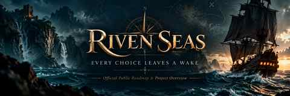
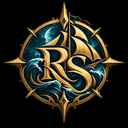
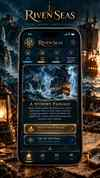

  

  <strong>Premium narrative pirate adventure</strong> 
  Android-first · Offline-first · Flutter · 5 languages · No ads

  <a href="PUBLIC_ROADMAP.md"><strong>Explore the public roadmap →</strong></a>

## Riven Seas

**Riven Seas** is a choice-driven pirate narrative game where fast decisions create persistent consequences across crew, factions, characters, treasures and endings.

The experience is designed around illustrated situations and two-way choices rather than real-time combat. The world starts grounded in rivalry, survival and maritime power, then gradually opens toward stranger legends and anomalies.

  

## A glimpse of the direction

<table>
<tr>
<td width="50%" align="center">
   
  <strong>Voyage hub</strong> — premium nautical presentation
</td>
<td width="50%" align="center">
   
  <strong>Decision experience</strong> — readable state, art and consequence
</td>
</tr>
</table>

> These visuals are **directional concept art**, not final shipping screenshots. The final UI remains subject to responsive, accessibility, performance and production validation.

## Roadmap at a glance

| Release | Cards | Arcs | Characters | Endings |
|---|---:|---:|---:|---:|
| **V1** | 600 | 100 | 45 | 12 |
| **V2** | 900 | 120 | 60 | 18 |
| **V3** | 1,200 | 140 | 75 | 24 |
| **V4** | 1,600 | 160 | 90 | 30 |

Final structure target: **20 sagas × 8 arcs**.

## Built around a few hard principles

- offline-first narrative and progression;
- Android first;
- five languages produced alongside content;
- portrait + landscape + tablet support;
- large-text and TalkBack support;
- deterministic choices and saves;
- free coherent prologue + one-time full-game unlock;
- no ads, subscriptions, energy system or consumable currency;
- strict download-size budget, with an absolute V4 cap of **80 MB**.

## Public project information

This repository intentionally contains only public-safe material.

It does **not** contain the complete arc catalogue, ending triggers, hidden narrative formulas, internal production notes or private planning documents.

→ [Read the public roadmap](PUBLIC_ROADMAP.md)

---

Riven Seas · Public project repository · Roadmap Revision 2.0

